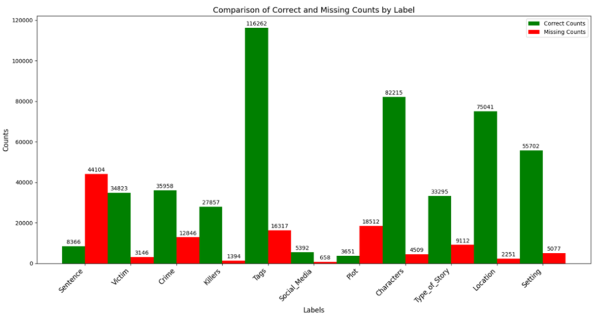
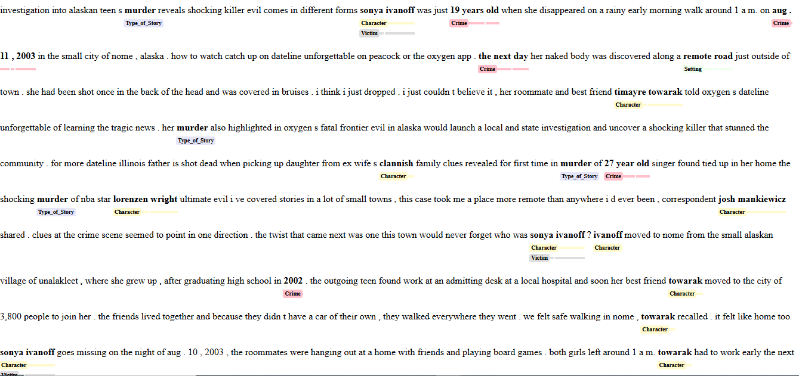

# BERT-Based Text Categorization Model with NER and SPANCAT

## Overview
This project implements a **BERT-based text categorization model** trained on an article dataset. To improve accuracy and effectiveness, a **hybrid approach** was used, incorporating **Named Entity Recognition (NER)** and **Span Categorization (SPANCAT)** models. Various **Natural Language Processing (NLP)** techniques were applied to preprocess and normalize text data, ensuring high-quality input for model training.

---

## 📊 Data Information
- **Total Articles:** 10,123
- **Categories:** 350,000+
- **Category Types:**
  - Crime
  - Victim
  - Type of Story
  - Sentence
  - Plot
  - Tags
  - Social Media
  - Characters
  - Location
  - Setting

### 🔍 Data Analysis
- **Comparison of correct vs. missing counts** by category types to evaluate model accuracy.
- 

### ⚠️ Challenges
- **Overlapping spans** between different category types.
- **Crime, Sentence, and Plot categories** may differ from how they are presented in the article.
- **Inconsistent data** affecting model generalization.
- **Low number of examples** for Social Media, Plot, and Sentence categories, leading to class imbalance.

---

## 🛠 Preprocessing Steps for Text Normalization
To improve consistency and model performance, the following preprocessing steps were applied:

### 1️⃣ Handling URLs and Email Formatting
- Replaced `http://` and `https://` with `http` to simplify representation.
- Removed unnecessary characters (`:`, `/`, `.`) to improve tokenization.
- **Example:**
  - **Input:** `Visit http://example.com or contact support@example.com`
  - **Output:** `visit http example com or contact support example com`

### 2️⃣ Replacing Special Characters
- Removed unwanted characters while keeping readability intact.
- Replaced punctuation marks (`!`, `+`, `-`, `@`, `—`, `–`, `“”`, `‘’`) with spaces.
- **Example:**
  - **Input:** `He said—“That’s great!”`
  - **Output:** `he said that s great`

### 3️⃣ Normalizing Compound Words
- Replaced non-alphanumeric characters within words with spaces.
- **Example:**
  - **Input:** `chippendales––she, 24/7, high-speed`
  - **Output:** `chippendales she, 24 7, high speed`

### 4️⃣ Converting Text to Lowercase
- Standardized text to **lowercase** to eliminate case sensitivity.
- **Example:**
  - **Input:** `Hello World!`
  - **Output:** `hello world`

### 5️⃣ Removing Extra Whitespace
- Eliminated redundant spaces to produce **clean and compact** text.
- **Example:**
  - **Input:** `This is   an  example`
  - **Output:** `this is an example`

### 🔍 **Challenges & Observations**
- Handling text with **mixed symbols** without losing meaningful context (e.g., `24/7 → 24 7`).
- Preprocessing improved tokenization quality, reduced noise, and led to **better model performance**.

---

## 🚀 Methodology
### **🔹 Named Entity Recognition (NER) Models**
NER models were used to extract well-defined entities such as **Crime, Location, Characters, Setting, and Tags**.

#### ✅ Why NER?
- Best suited for structured entity extraction with **predefined categories**.
- Enables **precise identification** of key components in text.

#### 🏆 Models Used:
1. **Model 1:** Fine-tuned for **Crime, Location, and Characters**.
2. **Model 2:** Custom-trained for **Setting**.
3. **Model 3:** Custom-trained for **Tags**.

### **🔹 Span Categorization (SPANCAT) Model**
SPANCAT models were utilized for extracting **free-form spans** such as **Killers, Victims, Type of Story, and Social Media**.

#### ✅ Why SPANCAT?
- Ideal for detecting spans that do not align with standard **token boundaries**.
- Provides flexibility to capture **nuanced information** that NER models might miss.

---

## 📷 Output Images
This section contains sample outputs from the **BERT-based text categorization model, NER, and SPANCAT models**.

### 📌 Sample 1: Text Categorization Output

---

## 📌 Conclusion
This project successfully integrates **BERT-based categorization** with **NER and SPANCAT models** to classify articles effectively. The combination of **structured entity extraction** and **free-form span identification** enhances the model’s ability to handle complex textual data.
